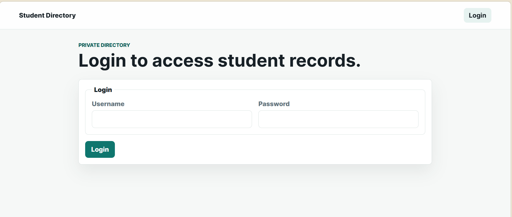
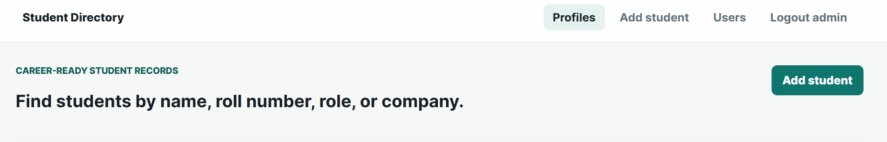
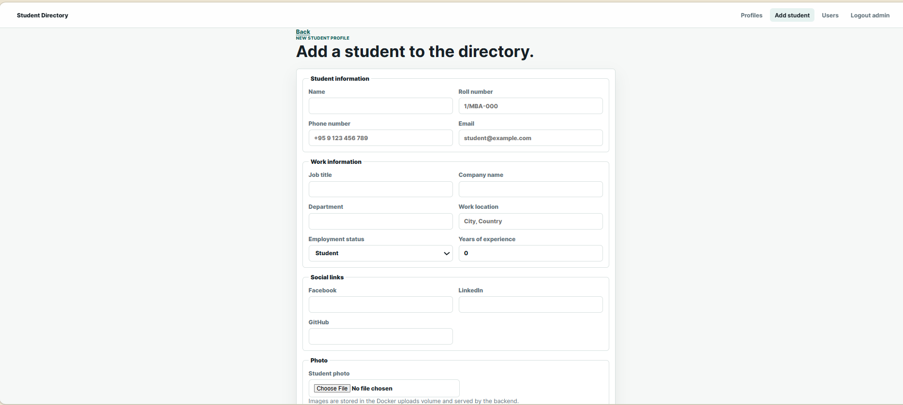

# UCMS MBA 3rd Batch's Student Directory

A production-ready student directory built with React, Node.js, Express, MongoDB, Docker Compose, and persistent local upload storage.

## Features

- Add, edit, view, and delete student profiles.
- Upload a student photo with `multipart/form-data`.
- Store career details, required phone number, optional email, and social links.
- Search by name, roll number, company, or job title.
- Filter by employment status and location.
- Pagination, sorting, delete confirmation, loading states, and error states.
- Login is required to view, add, or edit student profiles.
- Admin users can create users and delete student profiles.
- Highlight currently employed full-time students.
- Persist MongoDB data in `mongo-data`.
- Persist uploaded images in `uploads-data`.

## Folder Structure

```text
student-directory/
  backend/
    src/
      config/
        db.js
      controllers/
        authController.js
        studentController.js
      middleware/
        auth.js
        errorHandler.js
        upload.js
      models/
        Student.js
        User.js
      routes/
        authRoutes.js
        studentRoutes.js
      server.js
    .dockerignore
    .env.example
    Dockerfile
    package.json
  frontend/
    src/
      components/
        Pagination.jsx
        SearchFilters.jsx
        StatusBadge.jsx
        StudentCard.jsx
      pages/
        Login.jsx
        StudentDetail.jsx
        StudentForm.jsx
        StudentList.jsx
        UserManagement.jsx
      services/
        api.js
      utils/
        studentForm.js
      App.jsx
      main.jsx
      styles.css
    .dockerignore
    .env.example
    Dockerfile
    index.html
    package.json
    server.js
  .env.example
  docker-compose.yml
  README.md
```

## API Endpoints

Base URL through your host Nginx proxy:

```text
/api
```

Direct backend URL during local testing:

```text
http://localhost:5000
```

Endpoints:

```text
POST   /students      login required
GET    /students      login required
GET    /students/:id  login required
PUT    /students/:id  login required
DELETE /students/:id  admin required
```

Auth endpoints:

```text
POST /auth/login       public
GET  /auth/users       admin required
POST /auth/users       admin required
```

The first admin account comes from environment variables. After logging in as that admin, use the Users page to create normal users or additional admins.

Supported query parameters:

```text
search=
name=
rollNumber=
company=
jobTitle=
status=
location=
page=
limit=
sortBy=createdAt|name|rollNumber|work.experienceYears|work.company
sortOrder=asc|desc
```

Uploaded images are served from:

```text
/uploads/<filename>
```

## Student Data Model

```text
name                  string, required
rollNumber            string, unique, required
phone                 string, required
email                 string, optional
work.jobTitle         string
work.company          string
work.department       string
# 🎓 UCMS MBA Student Directory


A **production-ready full-stack student directory system** built with modern web technologies and containerized deployment.

---

## 🚀 Quick Start

```bash
cp .env.example .env
docker compose up --build -d
```

Open in browser:

👉 http://localhost:8080

---

## 🧩 Overview

This system allows managing student profiles with authentication, search, filtering, and image uploads.

### ✨ Key Capabilities

* Secure login & role-based access
* Full CRUD for student profiles
* Advanced search & filtering
* Image upload & storage
* Pagination & sorting
* Admin user management

---

## 🏗️ Architecture

```text
Client Browser
     ↓
Nginx (Reverse Proxy)
     ↓
Frontend (React - Port 4173)
     ↓
Backend API (Node.js - Port 5000)
     ↓
MongoDB (Database)
```

---

## 🛠️ Tech Stack

| Layer      | Technology        |
| ---------- | ----------------- |
| Frontend   | React (Vite)      |
| Backend    | Node.js + Express |
| Database   | MongoDB           |
| Deployment | Docker Compose    |
| Proxy      | Nginx             |

---
## 📸 Screenshots
### Login Page


### Student List


### Student Form



```text
/docs/screenshots/
```

---

## 📂 Project Structure

```text
student-directory/
  backend/
  frontend/
  docker-compose.yml
  .env.example
  README.md
```

---

## 🔌 API Endpoints

### Students

```text
POST   /students
GET    /students
GET    /students/:id
PUT    /students/:id
DELETE /students/:id (admin)
```

### Auth

```text
POST /auth/login
GET  /auth/users (admin)
POST /auth/users (admin)
```

---

## 📊 Data Model

```text
name                  string
rollNumber            string (unique)
phone                 string
email                 string
work.company          string
work.jobTitle         string
photo                 /uploads/<filename>
```

---

## ⚙️ Environment Variables

```env
MONGO_URI=mongodb://mongo:27017/studentdb
PORT=5000
CORS_ORIGIN=http://localhost:8080
UPLOAD_DIR=/uploads
ADMIN_USERNAME=admin
ADMIN_PASSWORD=change-this-password
JWT_SECRET=change-this-to-a-long-random-secret
```

---

## 💾 Database Backup & Restore

### Backup

```bash
mongodump --uri="mongodb://localhost:27017/studentdb" --out=./backup
```

### Restore

```bash
mongorestore --uri="mongodb://localhost:27017" --drop ./backup/studentdb
```

---

## 🔐 Security Notes

* Do not commit `.env` files
* Change default admin credentials
* Use strong JWT secrets
* Restrict MongoDB to localhost

---

## 🌐 Production Deployment

1. Point domain to server IP
2. Configure host Nginx
3. Run Docker stack
4. Enable HTTPS (Let's Encrypt)

---

## 📌 Use Cases

* University student directory
* Internal employee directory
* Full-stack learning project
* Docker/Nginx deployment practice

---

## 🧠 Author Notes

This project demonstrates:

* Full-stack development
* Containerized deployment
* Reverse proxy architecture
* Practical DevOps workflow

---

## ⭐ If you find this useful

Give it a star ⭐ on GitHub and share!

---
